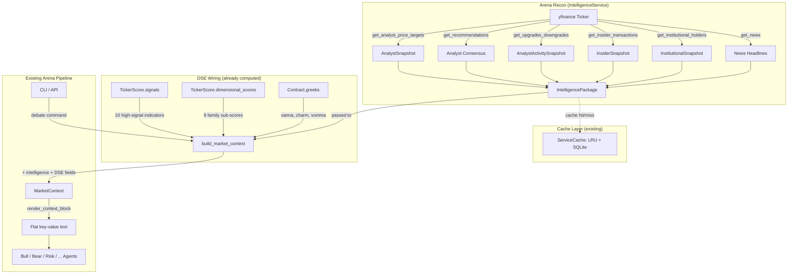

# PRD: Arena Recon — Market Intelligence Service

## Executive Summary

Options Arena's 7 debate agents argue using only technical indicators and first-order Greeks — they have zero awareness of analyst targets, insider transactions, institutional ownership, upgrades/downgrades, or the 40 DSE indicators already computed but never delivered to agents. Arena Recon closes both gaps by (a) building an `IntelligenceService` that fetches 6 unused yfinance methods for free, and (b) wiring 30 new fields (8 intelligence + 22 DSE) through `MarketContext` to all agents. Phase 1 requires zero new dependencies and $0/month.

## Problem Statement

**What problem are we solving?**
Debate agents make arguments in an information vacuum. A Bear agent can't cite that the CEO just sold $50M in stock. A Bull agent can't reference 3 analyst upgrades this week. A Risk agent can't anchor to Wall Street's consensus price target. Meanwhile, 40 DSE indicators and 8 DimensionalScores sub-scores are computed during scans and then discarded before agents ever see them.

**Why is this important now?**
- yfinance (already a dependency) provides 7 unused methods — analyst targets, recommendations, upgrades/downgrades, insider transactions, institutional holders, major holders, news — all free, all confirmed via live testing.
- The DSE engine (Epic 12, 576 tests) computes rich signal data that currently dead-ends at `TickerScore` without reaching `build_market_context()`.
- Combining both gaps into a single integration avoids two separate MarketContext schema changes.

## User Stories

### US-1: Analyst-Informed Debate
**As** an options trader running a debate, **I want** agents to reference analyst price targets and consensus ratings **so that** bull/bear arguments are anchored to Wall Street valuations.
- **Acceptance**: `options-arena debate AAPL` shows "Analyst Intelligence" section with target mean, upside %, and consensus score in the context block.

### US-2: Insider Activity Awareness
**As** an options trader, **I want** agents to know about recent insider buying/selling **so that** the Risk agent can flag potential conflicts between technicals and insider behavior.
- **Acceptance**: Context block shows "Insider Activity" section with net buys and buy ratio when data is available.

### US-3: DSE Signal Delivery
**As** a power user who runs scans before debates, **I want** dimensional scores and high-signal DSE indicators to appear in the debate context **so that** agents can cite regime classification, GEX, and volatility regime.
- **Acceptance**: After `scan --top 5`, running `debate {ticker}` shows "Signal Dimensions", "Volatility Regime", "Market & Flow Signals", and "Second-Order Greeks" sections.

### US-4: Graceful Degradation
**As** a user debating a small-cap ticker with no analyst coverage, **I want** the system to silently omit empty sections **so that** the output stays clean without error messages.
- **Acceptance**: Sections with all-None fields are not rendered. No errors or warnings for missing data.

### US-5: Config-Gated Intelligence
**As** a user who wants fast debates without intelligence fetching, **I want** a `--no-recon` CLI flag and `ARENA_RECON__ENABLED=false` config toggle **so that** I can skip intelligence when I don't need it.
- **Acceptance**: `--no-recon` suppresses intelligence sections. DSE sections remain (they're already computed).

## Context

Options Arena's debate agents (Bull, Bear, Risk, Volatility, Flow, Fundamental, Contrarian) argue using only technical indicators and Greeks. They have **zero awareness** of real-world context:

- A Bear agent doesn't know the CEO just sold $50M in stock
- A Risk agent doesn't know earnings are in 3 days with analysts expecting a beat
- A Bull agent can't cite the 3 analyst upgrades this week
- A Fundamental agent has no price target anchor from Wall Street consensus

**Critical discovery:** yfinance (already a dependency) provides 7 unused methods that deliver analyst targets, recommendations, upgrades/downgrades, insider transactions, institutional holders, major holders, and news — all free, all confirmed via Context7 + live testing. Arena is sitting on a gold mine of intelligence data it never fetches.

**Second discovery:** 40 DSE indicators are computed during scans but never reach agents via MarketContext. Only 6 of 58 `IndicatorSignals` fields + 4 first-order Greeks pass through `build_market_context()`. The 8 `DimensionalScores` sub-scores (trend, iv_vol, hv_vol, flow, microstructure, fundamental, regime, risk) and high-signal DSE indicators like GEX, vol regime, skew ratio, and vanna/charm/vomma are computed then discarded before agents see them. This plan wires both gaps — external intelligence (yfinance) and internal DSE signals — into MarketContext in a single integration.

---

## 1. Product Definition

**Name: Arena Recon** — the intelligence/reconnaissance arm of Options Arena.

**Product shape: Integrated library** (Shape B) — a new `IntelligenceService` class in the existing `services/` layer, following the exact OpenBB pattern (guarded imports, config-gated, never-raises, cache-first, typed models).

**Why not a daemon or standalone app:**
- Zero new infrastructure (no scheduler, no separate process)
- Identical DI/lifecycle pattern to OpenBBService (proven)
- Same cache, rate limiter, and SQLite persistence
- Incremental rollout via per-category config toggles
- Independently testable via the same mock patterns

**Interaction model:** Fully autonomous. Data fetched on-demand at debate time (like OpenBB enrichment). User can disable categories via config or `--no-recon` CLI flag.

**Config prefix:** `ARENA_RECON__` (e.g., `ARENA_RECON__ENABLED=false`, `ARENA_RECON__ANALYST_CACHE_TTL=86400`)

---

## 2. Intelligence Categories

### Priority-ranked by agent impact

| # | Category | Source | Cost | Legal | Signal | Phase |
|---|----------|--------|------|-------|--------|-------|
| 1 | **Analyst Price Targets** | yfinance `get_analyst_price_targets()` | Free | Public API | **High** — concrete valuation anchor | 1 |
| 2 | **Analyst Consensus** | yfinance `get_recommendations()` | Free | Public API | **High** — quantitative buy/sell signal | 1 |
| 3 | **Upgrades/Downgrades** | yfinance `get_upgrades_downgrades()` | Free | Public API | **High** — catalyst events | 1 |
| 4 | **Insider Transactions** | yfinance `get_insider_transactions()` | Free | Public API | **High** — insiders know their company | 1 |
| 5 | **Institutional Ownership** | yfinance `get_institutional_holders()` + `get_major_holders()` | Free | Public API | **Medium** — quality/stability signal | 1 |
| 6 | **News Headlines** | yfinance `get_news(count=10)` — returns `list[dict]`, title at `item["content"]["title"]` | Free | Public API | **Medium** — often priced in | 1 (fallback for OpenBB) |
| 7 | **SEC EDGAR Form 4** | `data.sec.gov` JSON API | Free | Public domain | **High** — richer insider data | 2 |
| 8 | **News Digest (LLM)** | Groq summarization of headlines | Free tier | Groq ToS | **Medium** — synthesized context | 2 |
| 9 | **Earnings Estimates** | yfinance `get_earnings_dates()` | Free | Public API | **High** — surprise/beat rate | 2 |
| 10 | **Social Sentiment** | Reddit JSON API | Free tier | Reddit ToS | **Low** — noisy | 3 |
| 11 | **Macro Events** | FRED API (existing) | Free | Public API | **Medium** — broad market | 4 |
| 12 | **Congressional Trading** | Quiver Quant API | ~$20/mo | API ToS | **Medium** — proven alpha | 4 |

---

## 3. Architecture

### Data Flow Diagram



### DSE Wiring Detail

**No new computation.** DSE indicators are already computed during scan pipeline phases 2-3 and stored on `TickerScore`. This plan adds passthrough mapping only:

```
TickerScore.signals                      → MarketContext DSE individual fields
  .vol_regime                              → vol_regime
  .iv_hv_spread                            → iv_hv_spread
  .gex                                     → gex
  .unusual_activity_score                  → unusual_activity_score
  .skew_ratio                              → skew_ratio
  .vix_term_structure                      → vix_term_structure
  .market_regime                           → market_regime
  .rsi_divergence                          → rsi_divergence
  .expected_move                           → expected_move
  .expected_move_ratio                     → expected_move_ratio

TickerScore.dimensional_scores           → MarketContext dim_* fields
  .trend                                   → dim_trend
  .iv_vol                                  → dim_iv_vol
  .hv_vol                                  → dim_hv_vol
  .flow                                    → dim_flow
  .microstructure                          → dim_microstructure
  .fundamental                             → dim_fundamental
  .regime                                  → dim_regime
  .risk                                    → dim_risk

TickerScore.direction_confidence         → direction_confidence

first_contract.greeks                    → Second-order Greeks
  (computed via pricing/dispatch.py)       → target_vanna, target_charm, target_vomma
```

**Selection criteria for the 10 individual indicators:** Chosen for highest agent debate value — regime classification (vol_regime, market_regime), directional pressure (gex, skew_ratio, rsi_divergence), volatility context (iv_hv_spread, vix_term_structure, expected_move, expected_move_ratio), and flow anomaly (unusual_activity_score). The remaining 30 indicators are captured via the 8 DimensionalScores sub-scores.

### Service Pattern (mirrors OpenBBService exactly)

```
IntelligenceService.__init__(config: IntelligenceConfig, cache: ServiceCache, limiter: RateLimiter)
    │
    ├── fetch_analyst_targets(ticker) -> AnalystSnapshot | None      [never-raises]
    ├── fetch_analyst_activity(ticker) -> AnalystActivitySnapshot | None  [never-raises]
    ├── fetch_insider_activity(ticker) -> InsiderSnapshot | None     [never-raises]
    ├── fetch_institutional(ticker) -> InstitutionalSnapshot | None  [never-raises]
    ├── fetch_news_headlines(ticker) -> list[str] | None             [never-raises]
    ├── fetch_intelligence(ticker, price) -> IntelligencePackage | None  [aggregator]
    └── close() -> None
```

Each method follows the 6-step pattern:
1. Config gate (master + feature toggle) → return `None` if disabled
2. Cache check → return cached model if fresh
3. Rate-limited yfinance call via `asyncio.to_thread` + `asyncio.wait_for`
4. Map untyped output → frozen Pydantic model (with `_safe_float`/`_safe_int`/NaN guards)
5. Cache result → return model
6. Outer `except Exception: return None` with `exc_info=True` logging

**Critical parsing notes for step 4:**
- `get_recommendations()`: Filter to `period == "0m"` row; columns are **camelCase** (`strongBuy`, `strongSell`)
- `get_upgrades_downgrades()`: Date is in **index** (`GradeDate`), not a column; `Action` values are abbreviated (`up`/`down`/`init`/`main`/`reit`) — must map to full words
- `get_insider_transactions()`: `Transaction` column is **always empty** — parse type from `Text` column; column is `Insider` not `Filer`, `Position` not `Relationship`, `Start Date` not `Date`; `Value` can be NaN
- `get_major_holders()`: Single `Value` column indexed by string keys (`insidersPercentHeld`, `institutionsPercentHeld`, etc.) — access via `df.loc[key, "Value"]`
- `get_institutional_holders()`: Percentage column is `pctHeld` (float, e.g. `0.097`), NOT `% Out`
- `get_news(count=N)`: Returns `list[dict]` with nested structure — title at `item["content"]["title"]`

---

## 4. Intelligence Schema (Pydantic Models)

> **Verified 2026-03-02** against live yfinance 1.2.0 API calls (AAPL). All column names,
> return types, and index structures confirmed via smoke test. Context7 docs had errors
> (`_count` parameter, `% Out` column name) — corrections applied below.
>
> **Re-verified 2026-03-03** via Context7 query: `get_analyst_price_targets()` dict keys,
> `get_recommendations()` camelCase columns, and `get_upgrades_downgrades()` structure all
> confirmed. Context7 still shows `% Out` for institutional holders and `_count` for news —
> live testing overrides these. `get_insider_purchases()` is a separate method from
> `get_insider_transactions()` — the PRD uses the latter (richer data, includes sells).

**New file:** `src/options_arena/models/intelligence.py`

### AnalystSnapshot (frozen)
| Field | Type | Source |
|-------|------|--------|
| `ticker` | `str` | — |
| `target_low` | `float \| None` | `get_analyst_price_targets()["low"]` |
| `target_high` | `float \| None` | `["high"]` |
| `target_mean` | `float \| None` | `["mean"]` |
| `target_median` | `float \| None` | `["median"]` |
| `target_current` | `float \| None` | `["current"]` |
| `strong_buy` | `int` | `get_recommendations()` row where `period == "0m"`, column `strongBuy` |
| `buy` | `int` | column `buy` |
| `hold` | `int` | column `hold` |
| `sell` | `int` | column `sell` |
| `strong_sell` | `int` | column `strongSell` |
| `consensus_score` | `float \| None` | Computed: weighted [-1.0, 1.0] |
| `target_upside_pct` | `float \| None` | `(mean - price) / price` |
| `fetched_at` | `datetime` (UTC) | — |

**Validators:** `math.isfinite()` on all floats, UTC on datetime, non-negative on counts.

**`consensus_score` formula:**
```python
total = strong_buy + buy + hold + sell + strong_sell
if total == 0: return None
score = (strong_buy*2 + buy*1 + hold*0 + sell*-1 + strong_sell*-2) / (total * 2)
# Normalized to [-1.0, 1.0]
```

### UpgradeDowngrade (frozen)
| Field | Type | Source |
|-------|------|--------|
| `firm` | `str` | column `Firm` |
| `action` | `str` — "upgrade", "downgrade", "initiated", "maintained", "reiterated" | column `Action` — raw values are abbreviated: `up`, `down`, `init`, `main`, `reit`. Map via `ACTION_MAP` dict. |
| `to_grade` | `str` | column `ToGrade` |
| `from_grade` | `str \| None` | column `FromGrade` (empty string → `None`) |
| `date` | `date` | **DataFrame index** `GradeDate` (datetime64), NOT a column |
| `price_target` | `float \| None` | column `currentPriceTarget` (0.0 → `None`) |
| `prior_price_target` | `float \| None` | column `priorPriceTarget` (0.0 → `None`) |

**Action mapping (required):**
```python
ACTION_MAP: dict[str, str] = {
    "up": "upgrade",
    "down": "downgrade",
    "init": "initiated",
    "main": "maintained",
    "reit": "reiterated",
}
```

### AnalystActivitySnapshot (frozen)
| Field | Type |
|-------|------|
| `ticker` | `str` |
| `recent_changes` | `list[UpgradeDowngrade]` (up to 10, most recent first) |
| `upgrades_30d` | `int` — count where `action in ("upgrade", "initiated")` in last 30d |
| `downgrades_30d` | `int` — count where `action == "downgrade"` in last 30d |
| `net_sentiment_30d` | `int` (upgrades - downgrades) |
| `fetched_at` | `datetime` (UTC) |

### InsiderTransaction (frozen)
| Field | Type | Source column |
|-------|------|---------------|
| `insider_name` | `str` | column `Insider` (all-caps name, e.g. `"LEVINSON ARTHUR D"`) |
| `position` | `str` | column `Position` (e.g. `"Director"`, `"Chief Executive Officer"`, `"Chief Financial Officer"`) |
| `transaction_type` | `str` | **Parsed from `Text` column** — the `Transaction` column is always empty. Parse via: `"Sale" in text` → `"Sale"`, `"Purchase" in text` → `"Purchase"`, `"Stock Gift" in text` → `"Gift"`, else `"Other"` |
| `shares` | `int` | column `Shares` |
| `value` | `float \| None` | column `Value` (can be `0.0` for gifts or `NaN` — treat both as `None`) |
| `ownership_type` | `str` | column `Ownership` — `"D"` (direct) or `"I"` (indirect) |
| `transaction_date` | `date \| None` | column `Start Date` (Timestamp → `.date()`) |

**Transaction type parsing (required):**
```python
def _parse_transaction_type(text: str) -> str:
    """Parse transaction type from Text column since Transaction column is always empty."""
    if not text:
        return "Other"
    text_lower = text.lower()
    if "sale " in text_lower or text_lower.startswith("sale"):
        return "Sale"
    if "purchase" in text_lower:
        return "Purchase"
    if "gift" in text_lower:
        return "Gift"
    if "exercise" in text_lower:
        return "Exercise"
    return "Other"
```

**Buy/Sell classification for aggregation:**
- `"Purchase"` → counted as buy
- `"Sale"` → counted as sell
- `"Gift"`, `"Exercise"`, `"Other"` → excluded from buy/sell ratio

### InsiderSnapshot (frozen)
| Field | Type |
|-------|------|
| `ticker` | `str` |
| `transactions` | `list[InsiderTransaction]` (up to 20) |
| `net_insider_buys_90d` | `int` (buy_count - sell_count) |
| `net_insider_value_90d` | `float \| None` (sum buy$ - sum sell$) |
| `insider_buy_ratio` | `float \| None` [0.0, 1.0] |
| `fetched_at` | `datetime` (UTC) |

### InstitutionalSnapshot (frozen)
| Field | Type | Source |
|-------|------|--------|
| `ticker` | `str` | — |
| `institutional_pct` | `float \| None` [0.0, 1.0] | `get_major_holders()` → `df.loc["institutionsPercentHeld", "Value"]` |
| `institutional_float_pct` | `float \| None` [0.0, 1.0] | `get_major_holders()` → `df.loc["institutionsFloatPercentHeld", "Value"]` |
| `insider_pct` | `float \| None` [0.0, 1.0] | `get_major_holders()` → `df.loc["insidersPercentHeld", "Value"]` |
| `institutions_count` | `int \| None` | `get_major_holders()` → `int(df.loc["institutionsCount", "Value"])` |
| `top_holders` | `list[str]` (top 5 names) | `get_institutional_holders()` → column `Holder` |
| `top_holder_pcts` | `list[float]` (top 5 pcts) | `get_institutional_holders()` → column `pctHeld` (float, e.g. `0.097`) |
| `fetched_at` | `datetime` (UTC) | — |

**`get_major_holders()` structure (verified):** Single-column DataFrame, column `Value`, indexed by string keys:
```
Index                            Value
insidersPercentHeld              0.0184
institutionsPercentHeld          0.6518
institutionsFloatPercentHeld     0.6640
institutionsCount             7491.0000
```
Access via `df.loc[key, "Value"]`. Guard with `KeyError` fallback to `None`.

**Context7 vs live discrepancy:** Context7 docs show `% Out` as the column name for `get_institutional_holders()`. Live yfinance 1.2.0 testing on 2026-03-02 confirmed the actual column is `pctHeld` (float, e.g. `0.097`). Similarly, `get_news()` parameter is `count` (no underscore prefix), not `_count` as Context7 shows. **Always trust live testing over docs when they conflict.**

### IntelligencePackage (frozen, aggregator)
| Field | Type |
|-------|------|
| `ticker` | `str` |
| `analyst` | `AnalystSnapshot \| None` |
| `analyst_activity` | `AnalystActivitySnapshot \| None` |
| `insider` | `InsiderSnapshot \| None` |
| `institutional` | `InstitutionalSnapshot \| None` |
| `news_headlines` | `list[str] \| None` (up to 5 titles, extracted via `item["content"]["title"]`) |
| `fetched_at` | `datetime` (UTC) |

Method: `intelligence_completeness() -> float` — fraction of categories populated.

---

## 5. Source Catalog

| Source | Endpoint / Method | Return Type | Key Columns/Keys | Legal Status | Cache TTL |
|--------|-------------------|-------------|------------------|-------------|-----------|
| yfinance analyst targets | `Ticker.get_analyst_price_targets()` | `dict` | `current`, `high`, `low`, `mean`, `median` (all `float`) | Yahoo Finance ToS | 24h |
| yfinance recommendations | `Ticker.get_recommendations()` | `DataFrame` | `period`, **`strongBuy`**, `buy`, `hold`, `sell`, **`strongSell`** (camelCase) | ″ | 24h |
| yfinance upgrades/downgrades | `Ticker.get_upgrades_downgrades()` | `DataFrame` | Index: `GradeDate` (datetime64). Cols: `Firm`, `ToGrade`, `FromGrade`, `Action` (`up`/`down`/`init`/`main`/`reit`), `priceTargetAction`, `currentPriceTarget`, `priorPriceTarget` | ″ | 24h |
| yfinance insider transactions | `Ticker.get_insider_transactions()` | `DataFrame` | `Insider`, `Position`, `Transaction` (**always empty**), `Text` (parse type from here), `Shares`, `Value` (can be NaN), `Start Date`, `Ownership` (`D`/`I`), `URL` | ″ | 6h |
| yfinance institutional holders | `Ticker.get_institutional_holders()` | `DataFrame` | `Holder`, **`pctHeld`** (float, e.g. 0.097), `Shares`, `Value`, `Date Reported`, `pctChange` | ″ | 24h |
| yfinance major holders | `Ticker.get_major_holders()` | `DataFrame` | Single column `Value`, indexed by: `insidersPercentHeld`, `institutionsPercentHeld`, `institutionsFloatPercentHeld`, `institutionsCount` | ″ | 24h |
| yfinance news | `Ticker.get_news(count=10)` | `list[dict]` | Nested: `item["content"]["title"]`, `item["content"]["pubDate"]`, `item["content"]["provider"]["displayName"]` | ″ | 15min |
| SEC EDGAR (Phase 2) | `data.sec.gov/submissions/CIK{cik}.json` | JSON | Form 4 XML fields | Public domain (U.S. government) | 6h |
| Reddit JSON (Phase 3) | `reddit.com/r/{sub}/search.json` | JSON | Post title, score, comments | Reddit API ToS | 30min |
| FRED (existing) | `api.stlouisfed.org` | JSON | Series observations | Free with API key | 24h |

### Legal Analysis

- **yfinance:** Yahoo Finance ToS permit personal/research use. No redistribution. Arena Recon fetches for local analysis only — compliant. May throttle/block IPs with excessive usage (mitigated by caching + rate limiter).
- **SEC EDGAR:** Public domain by law (17 CFR 202.5). Requires `User-Agent` header with contact email. 10 req/s rate limit. No authentication needed. **Safest source.**
- **Reddit:** Public posts accessible via `.json` suffix without authentication. Reddit ToS allow low-volume non-commercial research. OAuth required for higher limits. **Phase 3 only.**
- **Twitter/X:** API requires paid plan ($100/mo minimum). **Not viable.**
- **StockTwits:** API deprecated/shut down in 2024. **Not viable.**
- **News content:** Store titles only (factual metadata), never full article text. Publisher attribution stored.

---

## 6. Integration with Options Arena

### 6A. MarketContext Extension

**New fields on `MarketContext`** (all `float | None` or `int | None`, default `None`):

```
# --- Arena Recon: Analyst Intelligence ---
analyst_target_mean: float | None         # mean analyst price target ($)
analyst_target_upside_pct: float | None   # (mean_target - price) / price
analyst_consensus_score: float | None     # [-1.0, 1.0] from recommendation counts

# --- Arena Recon: Analyst Activity ---
analyst_upgrades_30d: int | None          # upgrade count in 30 days
analyst_downgrades_30d: int | None        # downgrade count in 30 days

# --- Arena Recon: Insider Activity ---
insider_net_buys_90d: int | None          # buy_count - sell_count in 90 days
insider_buy_ratio: float | None           # buys / total [0.0, 1.0]

# --- Arena Recon: Institutional Ownership ---
institutional_pct: float | None           # fraction held by institutions [0.0, 1.0]

# --- DSE: Dimensional Scores (8 family sub-scores, 0-100) ---
dim_trend: float | None                  # trend family: adx, roc, supertrend, multi_tf_alignment, rsi_divergence, adx_exhaustion
dim_iv_vol: float | None                 # IV vol family: iv_hv_spread, iv_term_slope, vol_cone_percentile, ewma_vol_forecast
dim_hv_vol: float | None                 # HV vol family: hv_20d, vix_correlation
dim_flow: float | None                   # flow family: gex, oi_concentration, unusual_activity_score, max_pain_magnet
dim_microstructure: float | None         # microstructure: volume_profile_skew, dollar_volume_trend
dim_fundamental: float | None            # fundamental: earnings_em_ratio, days_to_earnings_impact, short_interest_ratio, etc.
dim_regime: float | None                 # regime: market_regime, vix_term_structure, risk_on_off_score, correlation_regime_shift
dim_risk: float | None                   # risk: pop, optimal_dte_score, spread_quality, max_loss_ratio

# --- DSE: High-Signal Individual Indicators ---
vol_regime: float | None                 # ordinal: NORMAL=0, ELEVATED=1, CRISIS=2
iv_hv_spread: float | None              # IV minus HV (positive = premium sellers favored)
gex: float | None                        # net gamma exposure (dealer hedging pressure)
unusual_activity_score: float | None     # composite flow anomaly score
skew_ratio: float | None                # put skew / call skew (directional pressure)
vix_term_structure: float | None         # (VIX3M - VIX) / VIX (contango vs backwardation)
market_regime: float | None              # ordinal: CRISIS=0, VOLATILE=1, TRENDING=2, MEAN_REVERTING=3
rsi_divergence: float | None            # price-RSI divergence signal
expected_move: float | None              # IV-implied expected move ($)
expected_move_ratio: float | None        # IV EM / historical avg 30d move

# --- DSE: Second-Order Greeks ---
target_vanna: float | None               # ∂delta/∂IV (cross-Greek)
target_charm: float | None               # ∂delta/∂time (delta decay)
target_vomma: float | None               # ∂vega/∂IV (second-order vol sensitivity)

# --- DSE: Direction Confidence ---
direction_confidence: float | None       # [0.0, 1.0] from DimensionalScores computation
```

**8 intelligence + 8 dimensional + 10 individual DSE + 3 second-order Greeks + 1 confidence = 30 new fields total.**

All optional, all with `math.isfinite()` validators. DSE fields sourced from `TickerScore.signals` (already computed during scan phases 2-3) and `TickerScore.dimensional_scores` (already computed in scoring).

**New ratio methods:**
- `intelligence_ratio()` — fraction of 8 intelligence fields populated (yfinance-sourced)
- `dse_ratio()` — fraction of 22 DSE fields populated (internally computed)

Parallel to existing `completeness_ratio()` (core technical) and `enrichment_ratio()` (OpenBB). Keeps all four ratio categories cleanly separated.

### 6B. New Sections in render_context_block()

Appended after existing OpenBB sections, before earnings warning:

```
## Analyst Intelligence
ANALYST TARGET MEAN ($): 195.50
ANALYST TARGET UPSIDE: 15.3%
ANALYST CONSENSUS: +0.72
UPGRADES/DOWNGRADES (30D): 3 up / 0 down

## Insider Activity
INSIDER NET BUYS (90D): 4
INSIDER BUY RATIO: 0.80

## Institutional Ownership
INSTITUTIONAL OWNERSHIP: 72.5%

## Signal Dimensions (0-100)
TREND: 72.4
IV VOLATILITY: 58.1
HV VOLATILITY: 45.0
FLOW: 81.3
MICROSTRUCTURE: 55.2
FUNDAMENTAL: 63.8
REGIME: 40.5
RISK: 69.0
DIRECTION CONFIDENCE: 0.78

## Volatility Regime
VOL REGIME: ELEVATED
IV-HV SPREAD: 8.5
SKEW RATIO: 1.32
VIX TERM STRUCTURE: 0.05
EXPECTED MOVE ($): 12.40
EXPECTED MOVE RATIO: 1.15

## Market & Flow Signals
MARKET REGIME: TRENDING
GEX: -2450000.00
UNUSUAL ACTIVITY SCORE: 74.2
RSI DIVERGENCE: -15.3

## Second-Order Greeks
VANNA: 0.0023
CHARM: -0.0018
VOMMA: 0.0041
```

Sections only appear when at least one field in the section is non-None (same pattern as OpenBB sections).

**Context budget impact:** ~25-35 lines currently → ~50-65 lines with all sections populated. Sparse tickers (small caps without analyst coverage or incomplete DSE) will have fewer lines. The 8192-token `num_ctx` budget has ~2000 tokens for context data — 65 labeled lines ≈ ~500 tokens, well within budget.

### 6C. How Each Agent Benefits

| Agent | Intelligence Gains | DSE Gains | Example Citation |
|-------|-------------------|-----------|------------------|
| **Bull** | Catalysts: upgrades, insider buying, target upside | High FLOW score, positive GEX, TRENDING regime | "ANALYST TARGET UPSIDE: +15.3% with GEX: +1.2M (dealer long gamma supports upside) and TREND: 72/100" |
| **Bear** | Red flags: downgrades, insider selling, target below price | Negative GEX, CRISIS regime, high UNUSUAL ACTIVITY | "INSIDER BUY RATIO: 0.10 and GEX: -2.5M (dealer short gamma amplifies downside)" |
| **Risk** | Conflicting signals: strong technicals vs insider selling | Dimensional breakdown reveals which families diverge | "TREND: 72 but REGIME: 40 and DIRECTION CONFIDENCE: 0.52 — mixed signal profile warrants caution" |
| **Fundamental** | Valuation anchors: price targets give concrete reference | FUNDAMENTAL dimension, earnings EM ratio | "ANALYST TARGET MEAN: $195.50 with FUNDAMENTAL: 64/100 and EXPECTED MOVE RATIO: 1.15" |
| **Volatility** | Event-driven IV: insider activity may precede news | Vol regime, IV-HV spread, skew ratio, vanna/charm/vomma | "VOL REGIME: ELEVATED, IV-HV SPREAD: 8.5, VANNA: 0.0023 — vol expansion likely to persist" |
| **Flow** | Unusual insider flow complements options flow data | GEX, OI concentration, unusual activity score | "UNUSUAL ACTIVITY SCORE: 74.2 with INSIDER NET BUYS: 4 — smart money aligned" |
| **Contrarian** | Extreme consensus invites reversal | Regime shifts, RSI divergence, direction confidence | "ANALYST CONSENSUS: +0.92 but RSI DIVERGENCE: -15.3 and MARKET REGIME: MEAN_REVERTING" |

**Agents receive raw labeled data** — they reason about it themselves (they are LLMs). No pre-digested text summaries. The prompt rules appendix already instructs agents to cite labeled values.

**No new agent needed.** The existing 7 agents consume both intelligence and DSE data via MarketContext automatically. The Volatility agent especially benefits from second-order Greeks and vol regime classification it previously couldn't access.

### 6D. Scoring Integration

**Composite score stays pure technical.** No intelligence data in the scan pipeline scoring.

**Separate `intelligence_score`** (0-100, informational only):
- Analyst consensus: 30% weight (normalized from [-1, 1] to [0, 100])
- Target upside: 25% weight (capped at +/- 50%)
- Insider activity: 30% weight (buy_ratio * 100)
- Analyst momentum: 15% weight (net upgrades, capped)
- Returns 50.0 (neutral) when no data available

Displayed alongside composite score in CLI and web UI. Does NOT affect scan ranking.

---

## 7. Build vs Buy Matrix

| Category | Build | Use yfinance (existing dep) | Use other existing | Recommended | Phase |
|----------|-------|----------------------------|-------------------|-------------|-------|
| Analyst Targets | N/A | **`get_analyst_price_targets()`** | — | **yfinance** | 1 |
| Analyst Consensus | N/A | **`get_recommendations()`** | — | **yfinance** | 1 |
| Upgrades/Downgrades | N/A | **`get_upgrades_downgrades()`** | — | **yfinance** | 1 |
| Insider Trading | N/A | **`get_insider_transactions()`** | SEC EDGAR (Phase 2) | **yfinance** | 1 |
| Institutional Flow | N/A | **`get_institutional_holders()` + `get_major_holders()`** | — | **yfinance** | 1 |
| News Headlines | N/A | **`get_news()`** | OpenBB (existing) | **yfinance** (fallback) | 1 |
| SEC EDGAR Form 4 | httpx + lxml | — | — | **Build** | 2 |
| News Digest | — | — | Groq LLM (existing) | **Groq** | 2 |
| Earnings Estimates | N/A | **`get_earnings_dates()`** | — | **yfinance** | 2 |
| Social Sentiment | httpx to Reddit JSON | — | — | **Build** | 3 |
| Macro Events | — | — | FRED (existing) | **Extend existing** | 4 |
| Congressional Trading | — | — | Quiver Quant API | **Buy API** ($20/mo) | 4 |

**Phase 1 requires zero new dependencies.**

---

## 8. Implementation Phases

### Phase 1 — Free yfinance Intelligence + DSE Wiring (DETAILED)

**Scope:** 6 unused yfinance methods → analyst, insider, institutional intelligence. Wire 40 DSE indicators + 8 DimensionalScores + second-order Greeks through MarketContext to agents. Zero new deps.
**Effort:** ~2.5 weeks, 2 epics (Epic A: intelligence service + models, Epic B: DSE wiring + context)
**New dependencies:** None
**Monthly cost:** $0

#### Files to Create

| File | Contents |
|------|----------|
| `src/options_arena/models/intelligence.py` | 7 Pydantic models: `AnalystSnapshot`, `UpgradeDowngrade`, `AnalystActivitySnapshot`, `InsiderTransaction`, `InsiderSnapshot`, `InstitutionalSnapshot`, `IntelligencePackage` |
| `src/options_arena/services/intelligence.py` | `IntelligenceService` class (6 public methods, all never-raises) |
| `data/migrations/010_intelligence_tables.sql` | `intelligence_snapshots` table for historical storage |
| `tests/unit/models/test_intelligence_models.py` | Model construction, validation, serialization (~40 tests) |
| `tests/unit/services/test_intelligence_service.py` | Service happy path, cache, errors, config toggles (~80 tests) |
| `tests/unit/agents/test_intelligence_context.py` | render_context_block with intelligence sections (~20 tests) |
| `tests/unit/agents/test_dse_context.py` | render_context_block with DSE sections: dimensions, vol regime, flow, second-order Greeks (~30 tests) |
| `tests/unit/agents/test_intelligence_orchestrator.py` | build_market_context with intelligence (~20 tests) |
| `tests/unit/agents/test_dse_orchestrator.py` | build_market_context with DSE mapping: dimensional scores, individual indicators, vanna/charm/vomma (~25 tests) |
| `tests/unit/services/test_intelligence_health.py` | Health check smoke test (~10 tests) |
| `tests/unit/models/test_intelligence_config.py` | Config validation, env overrides (~15 tests) |
| `tests/unit/models/test_dse_market_context.py` | MarketContext DSE field validators, dse_ratio(), NaN/Inf guards (~20 tests) |
| `tests/integration/test_intelligence_integration.py` | Real yfinance calls, `@pytest.mark.integration` (~15 tests) |

#### Files to Modify

| File | Change |
|------|--------|
| `src/options_arena/models/config.py` | Add `IntelligenceConfig(BaseModel)` + nest in `AppSettings` as `intelligence: IntelligenceConfig` |
| `src/options_arena/models/analysis.py` | Add 30 new fields to `MarketContext` (8 intelligence + 8 dimensional + 10 DSE individual + 3 second-order Greeks + 1 confidence) + `intelligence_ratio()` + `dse_ratio()` methods + validators |
| `src/options_arena/models/__init__.py` | Re-export intelligence models |
| `src/options_arena/agents/_parsing.py` | Add 7 new sections to `render_context_block()`: Analyst Intelligence, Insider Activity, Institutional Ownership, Signal Dimensions, Volatility Regime, Market & Flow Signals, Second-Order Greeks |
| `src/options_arena/agents/orchestrator.py` | Add `intelligence: IntelligencePackage | None = None` param to `build_market_context()` + map intelligence fields; map DSE fields from `TickerScore.signals` and `TickerScore.dimensional_scores`; extract vanna/charm/vomma from first recommended contract's Greeks; add to `run_debate()` and `run_debate_v2()` signatures |
| `src/options_arena/services/health.py` | Add `check_intelligence()` method + include in `check_all()` |
| `src/options_arena/services/__init__.py` | Re-export `IntelligenceService` |
| `src/options_arena/cli/commands.py` | Create `IntelligenceService` in debate command; add `--no-recon` flag; pass intelligence to `run_debate()` |
| `src/options_arena/api/deps.py` | Add `get_intelligence_service()` dependency provider |
| `src/options_arena/api/app.py` | Create `IntelligenceService` in lifespan; store on `app.state` |
| `src/options_arena/api/routes/debate.py` | Fetch intelligence before debate; pass to `run_debate()` |

#### Key Reusable Functions

| Function | Location | Reuse |
|----------|----------|-------|
| `_yf_call(fn, *args)` | `services/market_data.py` | Pattern to replicate (or extract to `helpers.py`) for yfinance wrapping |
| `_safe_float(value)` | `services/helpers.py` | Use for all untyped yfinance output |
| `_safe_int(value)` | `services/helpers.py` | Use for share counts |
| `_render_optional(label, value, fmt)` | `agents/_parsing.py` | Use for new context block sections |
| `ServiceCache.get/set` | `services/cache.py` | Same cache instance |
| `RateLimiter` | `services/rate_limiter.py` | Same limiter instance |

#### IntelligenceConfig

```python
class IntelligenceConfig(BaseModel):
    enabled: bool = True
    analyst_enabled: bool = True
    insider_enabled: bool = True
    institutional_enabled: bool = True
    news_fallback_enabled: bool = True  # yfinance news as fallback for OpenBB
    analyst_cache_ttl: int = 86400      # 24h
    insider_cache_ttl: int = 21600      # 6h
    institutional_cache_ttl: int = 86400  # 24h
    news_cache_ttl: int = 900           # 15min
    request_timeout: float = 15.0
```

### Phase 2 — NLP + SEC EDGAR + Earnings Estimates

**Scope:** Groq-based news digest, SEC EDGAR Form 4 parser, EPS estimate tracking.
**Effort:** ~2 weeks, 1 epic
**New dependencies:** None (Groq already available, lxml already a dependency)
**Estimated tests:** ~120
**Monthly cost:** $0

**Components:**
- `EdgarService` class: httpx to `data.sec.gov`, CIK lookup, Form 4 XML parsing with lxml
- News digest via Groq: batch 5-10 headlines → one-paragraph summary + sentiment
- Extend `fetch_earnings_date` with EPS estimates from `get_earnings_dates()`
- New MarketContext fields: `news_digest: str | None`, `earnings_surprise_pct: float | None`, `earnings_beat_rate: float | None`

### Phase 3 — Social Sentiment

**Scope:** Reddit sentiment aggregation, buzz scoring.
**Effort:** ~1 week, 1 epic
**New dependencies:** None (httpx already available)
**Estimated tests:** ~80
**Monthly cost:** $0

**Components:**
- `RedditService` class: httpx to `reddit.com/r/{sub}/search.json`
- Subreddits: wallstreetbets, options, stocks
- VADER sentiment on titles (reuse existing `_get_vader()` pattern)
- Buzz score: mention frequency normalized against 30-day baseline
- **Noise filter (critical):** minimum mention threshold, bot account filtering (account age < 30 days, karma < 100), duplicate detection, exponential decay weighting (recent mentions weighted higher)

### Phase 4 — Full Platform

**Scope:** Macro event calendar, alternative data, historical correlation engine.
**Effort:** ~3 weeks, 2 epics
**New dependencies:** `quiverquant` (optional, ~$20/mo API key)
**Estimated tests:** ~100
**Monthly cost:** ~$20

---

## 9. Monthly Cost Summary

| Phase | Monthly Cost | Cumulative |
|-------|-------------|------------|
| Phase 1 | $0 | $0 |
| Phase 2 | $0 | $0 |
| Phase 3 | $0 | $0 |
| Phase 4 | ~$20 (Quiver Quant) | ~$20 |

**Phases 1-3 are entirely free.** All data from yfinance (existing dependency), SEC EDGAR (public domain), Groq free tier, and Reddit public JSON.

---

## Success Criteria

| Metric | Target | Measurement |
|--------|--------|-------------|
| Intelligence coverage | >80% of S&P 500 tickers have analyst + insider data | `intelligence_completeness()` across scan universe |
| DSE delivery | 100% of scanned tickers have dimensional scores in debate context | `dse_ratio()` > 0 for all tickers that completed Phase 2-3 of scan |
| Context token budget | <600 tokens for fully-populated context block | Token count of `render_context_block()` output |
| Latency overhead | <3s added to debate time (parallel fetches + cache) | Wall-clock timing of `fetch_intelligence()` |
| Cache hit rate | >90% for analyst/institutional data (24h TTL) | Cache hit/miss logging |
| Zero regressions | All 2,917 existing tests pass after integration | `uv run pytest tests/ -v` |
| Agent citation density | Agents cite intelligence/DSE labels in >60% of debates | `compute_citation_density()` audit |

---

## Constraints & Assumptions

### Constraints
- **No new dependencies** for Phase 1 — all from yfinance (existing) + internal DSE
- **Never-raises contract** — every service method returns `TypedModel | None`, never throws
- **Yahoo Finance ToS** — personal/research use only, no redistribution of raw data
- **Rate limits** — yfinance may throttle IPs; mitigated by caching + token bucket rate limiter
- **8192-token context budget** — all new sections must fit within ~500 tokens
- **Windows compatibility** — `asyncio.to_thread` for yfinance calls (no signal handlers)

### Assumptions
- yfinance 1.2.0+ column names remain stable (verified 2026-03-02, schema documented)
- S&P 500 and mid-cap tickers have sufficient analyst/insider coverage (>80%)
- Small-cap/micro-cap tickers may have zero intelligence data — graceful degradation expected
- DSE indicators are pre-computed during scan; debate without prior scan has no DSE data
- OpenBB news remains primary when available; yfinance news is fallback only

---

## Out of Scope

- **Real-time streaming** — intelligence is fetched on-demand per debate, not streamed
- **Custom intelligence agents** — no new debate agents; existing 7 consume data via MarketContext
- **News article full text** — only titles stored (legal compliance + token budget)
- **Paid data sources** in Phase 1 — Quiver Quant and premium APIs deferred to Phase 4
- **Web UI intelligence display** — Phase 1 focuses on CLI + API; web UI enrichment is future work
- **Intelligence in scan ranking** — composite score stays pure technical; `intelligence_score` is informational only
- **Historical intelligence trend analysis** — SQLite storage for future use, but no trend queries in Phase 1
- **Social media sentiment** — deferred to Phase 3 (Reddit) and excluded (Twitter/X, StockTwits)

---

## Dependencies

### Internal
| Dependency | Module | Required For |
|-----------|--------|-------------|
| `MarketContext` model | `models/analysis.py` | Adding 30 new fields |
| `render_context_block()` | `agents/_parsing.py` | Adding 7 new sections |
| `build_market_context()` | `agents/orchestrator.py` | Mapping intelligence + DSE fields |
| `ServiceCache` | `services/cache.py` | Caching intelligence snapshots |
| `RateLimiter` | `services/rate_limiter.py` | Throttling yfinance calls |
| `_yf_call()` pattern | `services/market_data.py` | Wrapping yfinance in asyncio.to_thread |
| `TickerScore.signals` | `models/scoring.py` | Source for DSE individual indicators |
| `TickerScore.dimensional_scores` | `models/scoring.py` | Source for 8 family sub-scores |
| `pricing/dispatch.py` | `pricing/` | Second-order Greeks (vanna, charm, vomma) |

### External
| Dependency | Version | Status |
|-----------|---------|--------|
| yfinance | >=1.2.0 | Already installed |
| pydantic | >=2.12.5 | Already installed |
| aiosqlite | >=0.22.1 | Already installed (for migration 010) |

---

## 10. Verification Plan

### Unit Tests
```bash
uv run pytest tests/unit/models/test_intelligence_models.py -v
uv run pytest tests/unit/services/test_intelligence_service.py -v
uv run pytest tests/unit/agents/test_intelligence_context.py -v
uv run pytest tests/unit/agents/test_intelligence_orchestrator.py -v
```

### Full Suite (must pass)
```bash
uv run ruff check . --fix && uv run ruff format .
uv run pytest tests/ -v
uv run mypy src/ --strict
```

### Integration Smoke Test
```bash
uv run pytest tests/integration/test_intelligence_integration.py -v -m integration
```

### Manual Validation
1. `options-arena health` — verify "Intelligence" appears in health output
2. `options-arena debate AAPL` — verify all 7 new sections appear in context block: Analyst Intelligence, Insider Activity, Institutional Ownership, Signal Dimensions, Volatility Regime, Market & Flow Signals, Second-Order Greeks
3. `options-arena debate AAPL --no-recon` — verify intelligence sections absent, DSE sections still present (DSE is not gated by `--no-recon`)
4. `ARENA_RECON__ENABLED=false options-arena debate AAPL` — verify intelligence config toggle works; DSE sections unaffected
5. Debate a small-cap ticker with sparse data — verify graceful degradation (None fields omitted from all sections)
6. `options-arena scan --top 5` then `options-arena debate {ticker}` — verify DSE dimensional scores and individual indicators render with non-None values for a scanned ticker
7. Verify second-order Greeks (VANNA, CHARM, VOMMA) appear when contract has Greeks

---

## Key Design Decisions Summary

1. **Integrated library, not standalone app** — follows proven OpenBB pattern
2. **Phase 1 uses zero new dependencies** — all from unused yfinance methods + already-computed DSE
3. **Four-ratio system** — `completeness_ratio()`, `enrichment_ratio()`, `intelligence_ratio()`, `dse_ratio()` stay separated
4. **Composite score stays pure technical** — intelligence score is informational only
5. **Raw labeled data to agents** — agents reason about values, no pre-digested summaries
6. **No new agent** — existing 7 agents consume intelligence + DSE via MarketContext automatically
7. **Never-raises contract** — every service method returns `TypedModel | None`
8. **Sparse data is normal** — small caps may have no analyst coverage, and that's fine
9. **DimensionalScores as compact summary** — 8 sub-scores (0-100) give agents family-level signal strength without 40 raw indicator values cluttering context
10. **Curated DSE individuals** — only 10 highest-signal DSE indicators promoted to MarketContext (vol regime, GEX, skew ratio, etc.); remaining 30 are captured by dimensional sub-scores
11. **Second-order Greeks wired through** — vanna, charm, vomma already computed on recommended contracts but never exposed; now surfaced alongside delta/gamma/theta/vega
12. **DSE wiring is zero-cost** — all indicators already computed in scan phases 2-3 and stored on `TickerScore`; this plan only adds the passthrough to `build_market_context()` and `render_context_block()`
