# E2E Testing Framework — Options Arena Web UI

## 1. Architecture Diagram

```mermaid
flowchart TB
    subgraph Orchestrator["Test Orchestrator (CI / Local Runner)"]
        direction TB
        Config["playwright.config.ts<br/>4 workers, port isolation"]
        Reporter["Merged Report Generator<br/>JSON + HTML + CLI"]
    end

    subgraph Instance1["Instance 1 — Scan Workflows"]
        direction TB
        S1["scan.setup.ts<br/>Start backend :8001"]
        S2["scan-launch.spec.ts"]
        S3["scan-results.spec.ts"]
        S4["scan-cancel.spec.ts"]
        S5["scan-errors.spec.ts"]
    end

    subgraph Instance2["Instance 2 — Debate Workflows"]
        direction TB
        D1["debate.setup.ts<br/>Start backend :8002"]
        D2["debate-single.spec.ts"]
        D3["debate-batch.spec.ts"]
        D4["debate-export.spec.ts"]
        D5["debate-errors.spec.ts"]
    end

    subgraph Instance3["Instance 3 — Navigation + Dashboard + Health"]
        direction TB
        N1["nav.setup.ts<br/>Start backend :8003"]
        N2["dashboard.spec.ts"]
        N3["health.spec.ts"]
        N4["universe.spec.ts"]
        N5["navigation.spec.ts"]
        N6["routing.spec.ts"]
    end

    subgraph Instance4["Instance 4 — Edge Cases + WebSocket"]
        direction TB
        E1["edge.setup.ts<br/>Start backend :8004"]
        E2["ws-reconnect.spec.ts"]
        E3["ws-disconnect.spec.ts"]
        E4["operation-mutex.spec.ts"]
        E5["empty-states.spec.ts"]
        E6["api-failures.spec.ts"]
    end

    subgraph Backend["FastAPI Backend (per instance)"]
        direction LR
        B1[":8001<br/>Scan instance"]
        B2[":8002<br/>Debate instance"]
        B3[":8003<br/>Nav instance"]
        B4[":8004<br/>Edge instance"]
    end

    subgraph MockLayer["Mock / Fixture Layer"]
        direction TB
        MSW["API Route Handlers<br/>(Playwright route interception)"]
        WSM["WebSocket Mock Server<br/>(per-test fixtures)"]
        FIX["Fixture Factory<br/>(typed test data builders)"]
    end

    Config --> Instance1 & Instance2 & Instance3 & Instance4
    Instance1 --> B1
    Instance2 --> B2
    Instance3 --> B3
    Instance4 --> B4
    Instance1 & Instance2 & Instance3 & Instance4 --> MockLayer
    Instance1 & Instance2 & Instance3 & Instance4 --> Reporter
```



## 2. Technology Choices

### Browser Automation: **Playwright**

| Factor | Playwright | Cypress | Selenium |
|--------|-----------|---------|----------|
| Native parallel execution | 4+ workers, sharded | Serial per spec | Grid setup required |
| WebSocket testing | `page.evaluate()` + route interception | No native WS support | No native WS support |
| Multi-browser | Chromium, Firefox, WebKit | Chromium only (default) | All, but slow |
| TypeScript-first | Yes (native) | Yes | Adapter required |
| Auto-wait / retry | Built-in (locator API) | Built-in | Manual waits |
| Network interception | `page.route()` — request/response level | `cy.intercept()` | No native |
| CI integration | GitHub Actions native | Dashboard required | Grid required |
| Dark theme screenshot | Pixel-perfect, `colorScheme: 'dark'` | Limited | Limited |

**Decision: Playwright.** Native parallel workers map directly to the 4-instance requirement.
WebSocket interception via `page.evaluate()` + mock servers covers real-time flows. TypeScript
support matches the Vue/TS stack. Network-level route interception enables deterministic API mocking
without modifying application code.

### Test Data: **Fixture Factories (typed builders)**

No external DB seeding. All test data created via:
1. **Playwright route interception** (`page.route('/api/*', handler)`) for REST mocks
2. **WebSocket mock servers** (`ws` npm package) for streaming events
3. **Typed builder functions** that produce valid API response shapes

Rationale: The backend's `asyncio.Lock` mutex and SQLite state make shared-state tests
non-deterministic. Full API mocking gives each test instance isolated, reproducible data.

### Assertion Strategy: **Layered**

| Layer | Tool | What it checks |
|-------|------|---------------|
| DOM state | Playwright locators + `expect()` | Element text, visibility, count, attributes |
| API contract | Route interception assertions | Request params, response shapes |
| Visual regression | `expect(page).toHaveScreenshot()` | Pixel diff on key screens (dark theme) |
| Accessibility | `@axe-core/playwright` | WCAG 2.1 AA on each page |
| Console errors | `page.on('console')` collector | Zero unexpected errors |

## 3. Directory Structure

```
web/
    e2e/
        ARCHITECTURE.md              # This file
        playwright.config.ts         # Global config: 4 workers, ports, timeouts
        tsconfig.json                # Extends web/tsconfig.json + Playwright types

        fixtures/                    # Reusable test infrastructure
            builders/                # Typed factory functions
                scan.builders.ts     # buildScanRun(), buildTickerScore(), buildPaginatedScores()
                debate.builders.ts   # buildDebateResult(), buildAgentResponse(), buildTradeThesis()
                health.builders.ts   # buildHealthStatus()
                universe.builders.ts # buildUniverseStats()
                config.builders.ts   # buildConfigResponse()
            mocks/                   # Network-level mocking
                api-handlers.ts      # Reusable page.route() handler factory
                ws-server.ts         # In-process WebSocket mock server
                ws-scenarios.ts      # Predefined WS event sequences (scan, debate, batch)
            pages/                   # Page Object Models
                dashboard.page.ts
                scan.page.ts
                scan-results.page.ts
                debate-result.page.ts
                nav.page.ts          # Shared navigation bar interactions
            base.fixture.ts          # Extended Playwright test with app-specific fixtures

        suites/                      # Test specs partitioned by instance
            scan/                    # Instance 1
                scan-launch.spec.ts
                scan-progress.spec.ts
                scan-results-table.spec.ts
                scan-results-filter.spec.ts
                scan-cancel.spec.ts
                scan-errors.spec.ts
            debate/                  # Instance 2
                debate-single.spec.ts
                debate-batch.spec.ts
                debate-result-view.spec.ts
                debate-export.spec.ts
                debate-progress-modal.spec.ts
                debate-errors.spec.ts
            navigation/              # Instance 3
                dashboard.spec.ts
                health.spec.ts
                universe.spec.ts
                navigation.spec.ts
                routing-guards.spec.ts
                empty-states.spec.ts
            edge/                    # Instance 4
                ws-reconnect.spec.ts
                ws-disconnect.spec.ts
                operation-mutex.spec.ts
                api-failures.spec.ts
                api-timeout.spec.ts
                concurrent-users.spec.ts

        reports/                     # Generated (gitignored)
            results.json
            report.html
            screenshots/
```

## 4. Parallel Execution Configuration

### `playwright.config.ts`

```typescript
import { defineConfig, devices } from '@playwright/test'

// Each parallel instance gets a unique port offset
const BASE_PORT = 8001

export default defineConfig({
  testDir: './suites',
  timeout: 60_000,          // 60s per test (WebSocket flows are slow)
  retries: 2,               // Bounded retry: max 2 retries before hard fail
  workers: 4,               // 4 parallel instances
  fullyParallel: true,      // Tests within a file also run in parallel

  expect: {
    timeout: 10_000,        // 10s for assertions (PrimeVue renders can be slow)
    toHaveScreenshot: {
      maxDiffPixelRatio: 0.01,  // 1% pixel tolerance for dark theme variance
    },
  },

  reporter: [
    ['html', { outputFolder: './reports', open: 'never' }],
    ['json', { outputFile: './reports/results.json' }],
    ['list'],               // CLI summary
  ],

  use: {
    baseURL: `http://127.0.0.1:${BASE_PORT}`,
    colorScheme: 'dark',    // Match PrimeVue Aura dark theme
    screenshot: 'only-on-failure',
    trace: 'on-first-retry',
    video: 'on-first-retry',
    actionTimeout: 10_000,
  },

  // Projects = partitioned suites mapped to instances
  projects: [
    {
      name: 'scan-workflows',
      testDir: './suites/scan',
      use: {
        ...devices['Desktop Chrome'],
        baseURL: `http://127.0.0.1:${BASE_PORT}`,
      },
    },
    {
      name: 'debate-workflows',
      testDir: './suites/debate',
      use: {
        ...devices['Desktop Chrome'],
        baseURL: `http://127.0.0.1:${BASE_PORT + 1}`,
      },
    },
    {
      name: 'navigation',
      testDir: './suites/navigation',
      use: {
        ...devices['Desktop Chrome'],
        baseURL: `http://127.0.0.1:${BASE_PORT + 2}`,
      },
    },
    {
      name: 'edge-cases',
      testDir: './suites/edge',
      use: {
        ...devices['Desktop Chrome'],
        baseURL: `http://127.0.0.1:${BASE_PORT + 3}`,
      },
    },
  ],

  // Start one FastAPI backend per project (isolated ports, isolated SQLite DBs)
  webServer: [
    {
      command: `uv run uvicorn options_arena.api:create_app --factory --port ${BASE_PORT} --host 127.0.0.1`,
      port: BASE_PORT,
      reuseExistingServer: !process.env.CI,
      env: { ARENA_DATA__DB_PATH: '.e2e-test-1.db' },
      timeout: 30_000,
    },
    {
      command: `uv run uvicorn options_arena.api:create_app --factory --port ${BASE_PORT + 1} --host 127.0.0.1`,
      port: BASE_PORT + 1,
      reuseExistingServer: !process.env.CI,
      env: { ARENA_DATA__DB_PATH: '.e2e-test-2.db' },
      timeout: 30_000,
    },
    {
      command: `uv run uvicorn options_arena.api:create_app --factory --port ${BASE_PORT + 2} --host 127.0.0.1`,
      port: BASE_PORT + 2,
      reuseExistingServer: !process.env.CI,
      env: { ARENA_DATA__DB_PATH: '.e2e-test-3.db' },
      timeout: 30_000,
    },
    {
      command: `uv run uvicorn options_arena.api:create_app --factory --port ${BASE_PORT + 3} --host 127.0.0.1`,
      port: BASE_PORT + 3,
      reuseExistingServer: !process.env.CI,
      env: { ARENA_DATA__DB_PATH: '.e2e-test-4.db' },
      timeout: 30_000,
    },
  ],
})
```

### Execution Commands

```bash
# Run all 4 instances in parallel (default)
npx playwright test

# Run a single instance
npx playwright test --project=scan-workflows

# Run with UI mode for debugging
npx playwright test --ui

# Run against already-running backend (dev mode)
npx playwright test --project=scan-workflows --grep "scan launch"

# Generate HTML report
npx playwright show-report ./reports

# Update visual snapshots
npx playwright test --update-snapshots
```

## 5. Fixture Layer — Typed Test Data Builders

### `fixtures/builders/scan.builders.ts`

```typescript
import type { ScanRun, TickerScore, PaginatedResponse } from '../../src/types'

let scanIdCounter = 1000

export function buildScanRun(overrides: Partial<ScanRun> = {}): ScanRun {
  return {
    id: scanIdCounter++,
    started_at: '2026-02-26T14:00:00+00:00',
    completed_at: '2026-02-26T14:05:00+00:00',
    preset: 'sp500',
    tickers_scanned: 503,
    tickers_scored: 487,
    recommendations: 50,
    ...overrides,
  }
}

export function buildTickerScore(overrides: Partial<TickerScore> = {}): TickerScore {
  return {
    ticker: 'AAPL',
    composite_score: 7.3,
    direction: 'bullish',
    signals: {
      rsi_14: 55.2, sma_20: 1.02, sma_50: 0.98, sma_200: 1.05,
      macd_signal: 0.5, bb_width: 0.12, obv_trend: 0.8, atr_14: 3.2,
      vwap_ratio: 1.01, adx_14: 28.5, stoch_k: 62.1, stoch_d: 58.4,
      cci_20: 45.0, williams_r: -38.0, roc_12: 2.1, mfi_14: 55.0,
      cmf_20: 0.08, keltner_position: 0.6,
    },
    scan_run_id: 1,
    ...overrides,
  }
}

export function buildPaginatedScores(
  count: number = 50,
  overrides: Partial<PaginatedResponse<TickerScore>> = {},
): PaginatedResponse<TickerScore> {
  const tickers = [
    'AAPL', 'MSFT', 'GOOGL', 'AMZN', 'NVDA', 'META', 'TSLA', 'BRK.B',
    'JPM', 'V', 'UNH', 'XOM', 'JNJ', 'PG', 'MA', 'HD', 'CVX', 'MRK',
    'ABBV', 'LLY', 'PEP', 'KO', 'COST', 'AVGO', 'TMO', 'MCD', 'WMT',
    'CSCO', 'ACN', 'ABT', 'DHR', 'NEE', 'LIN', 'TXN', 'PM', 'UNP',
    'RTX', 'BMY', 'SCHW', 'AMGN', 'HON', 'COP', 'LOW', 'MS', 'INTC',
    'QCOM', 'ELV', 'INTU', 'ADP', 'SBUX',
  ]
  const directions: Array<'bullish' | 'bearish' | 'neutral'> = ['bullish', 'bearish', 'neutral']
  const items = tickers.slice(0, count).map((ticker, i) =>
    buildTickerScore({
      ticker,
      composite_score: 9.0 - i * 0.15,
      direction: directions[i % 3],
      scan_run_id: 1,
    }),
  )
  return {
    items,
    total: count,
    page: 1,
    pages: Math.ceil(count / 50),
    ...overrides,
  }
}
```

### `fixtures/builders/debate.builders.ts`

```typescript
import type { DebateResult, AgentResponse, TradeThesis, DebateResultSummary } from '../../src/types'

export function buildAgentResponse(overrides: Partial<AgentResponse> = {}): AgentResponse {
  return {
    agent_name: 'bull',
    direction: 'bullish',
    confidence: 0.72,
    argument: 'AAPL shows strong momentum with RSI at 55 and positive MACD crossover...',
    key_points: [
      'Strong earnings momentum with 15% YoY revenue growth',
      'Technical breakout above 200-day SMA',
      'Institutional accumulation on rising OBV',
    ],
    risks_cited: [
      'Extended P/E ratio at 28x forward earnings',
      'Potential sector rotation out of mega-cap tech',
    ],
    contracts_referenced: ['AAPL 2026-03-21 $195 Call'],
    model_used: 'llama-3.3-70b-versatile',
    ...overrides,
  }
}

export function buildTradeThesis(overrides: Partial<TradeThesis> = {}): TradeThesis {
  return {
    ticker: 'AAPL',
    direction: 'bullish',
    confidence: 0.68,
    summary: 'Moderately bullish outlook supported by technical momentum and earnings growth.',
    bull_score: 7.2,
    bear_score: 4.8,
    key_factors: [
      'Positive MACD crossover with expanding histogram',
      'Above 200-day SMA with rising volume',
      'Options flow showing institutional call buying',
    ],
    risk_assessment: 'Moderate risk. P/E is stretched but justified by growth. Key risk is macro.',
    recommended_strategy: 'Bull call spread: Buy $190C / Sell $200C, Mar 21 expiry',
    ...overrides,
  }
}

export function buildDebateResult(overrides: Partial<DebateResult> = {}): DebateResult {
  return {
    id: 1,
    ticker: 'AAPL',
    is_fallback: false,
    model_name: 'llama-3.3-70b-versatile',
    duration_ms: 12500,
    total_tokens: 4200,
    created_at: '2026-02-26T14:10:00+00:00',
    debate_mode: 'standard',
    citation_density: 0.85,
    bull_response: buildAgentResponse({ agent_name: 'bull', direction: 'bullish', confidence: 0.72 }),
    bear_response: buildAgentResponse({
      agent_name: 'bear', direction: 'bearish', confidence: 0.58,
      argument: 'AAPL faces headwinds from elevated valuation and macro uncertainty...',
      key_points: ['P/E at 28x exceeds 5-year average', 'Services revenue growth decelerating'],
      risks_cited: ['Federal Reserve tightening cycle', 'iPhone demand softening in China'],
    }),
    thesis: buildTradeThesis(),
    ...overrides,
  }
}

export function buildDebateSummary(overrides: Partial<DebateResultSummary> = {}): DebateResultSummary {
  return {
    id: 1,
    ticker: 'AAPL',
    direction: 'bullish',
    confidence: 0.68,
    is_fallback: false,
    model_name: 'llama-3.3-70b-versatile',
    duration_ms: 12500,
    created_at: '2026-02-26T14:10:00+00:00',
    ...overrides,
  }
}
```

## 6. Page Object Models

### `fixtures/pages/scan-results.page.ts`

```typescript
import { type Page, type Locator, expect } from '@playwright/test'

export class ScanResultsPage {
  readonly page: Page
  readonly table: Locator
  readonly searchInput: Locator
  readonly directionFilter: Locator
  readonly minScoreFilter: Locator
  readonly batchDebateBtn: Locator
  readonly rowCheckboxes: Locator
  readonly tickerDrawer: Locator
  readonly progressTracker: Locator

  constructor(page: Page) {
    this.page = page
    this.table = page.locator('[data-testid="scan-results-table"]')
    this.searchInput = page.locator('[data-testid="ticker-search"]')
    this.directionFilter = page.locator('[data-testid="direction-filter"]')
    this.minScoreFilter = page.locator('[data-testid="min-score-filter"]')
    this.batchDebateBtn = page.locator('[data-testid="batch-debate-btn"]')
    this.rowCheckboxes = page.locator('.p-datatable-tbody .p-checkbox')
    this.tickerDrawer = page.locator('[data-testid="ticker-drawer"]')
    this.progressTracker = page.locator('[data-testid="progress-tracker"]')
  }

  async goto(scanId: number): Promise<void> {
    await this.page.goto(`/scan/${scanId}`)
    await this.table.waitFor({ state: 'visible' })
  }

  async getRowCount(): Promise<number> {
    return this.page.locator('.p-datatable-tbody tr').count()
  }

  async getTickerAtRow(index: number): Promise<string> {
    return this.page.locator(`.p-datatable-tbody tr:nth-child(${index + 1}) td:first-child`).innerText()
  }

  async sortByColumn(columnHeader: string): Promise<void> {
    await this.page.locator(`.p-datatable-thead th:has-text("${columnHeader}")`).click()
  }

  async searchTicker(query: string): Promise<void> {
    await this.searchInput.fill(query)
    // Wait for DataTable re-render
    await this.page.waitForTimeout(300)
  }

  async filterByDirection(direction: 'bullish' | 'bearish' | 'neutral'): Promise<void> {
    await this.directionFilter.click()
    await this.page.locator(`[data-testid="direction-option-${direction}"]`).click()
  }

  async selectRows(indices: number[]): Promise<void> {
    for (const i of indices) {
      await this.rowCheckboxes.nth(i).click()
    }
  }

  async clickBatchDebate(): Promise<void> {
    await this.batchDebateBtn.click()
  }

  async openTickerDrawer(ticker: string): Promise<void> {
    await this.page.locator(`.p-datatable-tbody tr:has-text("${ticker}")`).click()
    await this.tickerDrawer.waitFor({ state: 'visible' })
  }

  async expectDirectionBadge(ticker: string, direction: string): Promise<void> {
    const row = this.page.locator(`.p-datatable-tbody tr:has-text("${ticker}")`)
    await expect(row.locator('[data-testid="direction-badge"]')).toHaveText(direction)
  }

  async expectScoreInRange(ticker: string, min: number, max: number): Promise<void> {
    const row = this.page.locator(`.p-datatable-tbody tr:has-text("${ticker}")`)
    const scoreText = await row.locator('[data-testid="composite-score"]').innerText()
    const score = parseFloat(scoreText)
    expect(score).toBeGreaterThanOrEqual(min)
    expect(score).toBeLessThanOrEqual(max)
  }
}
```

## 7. API Mock Layer

### `fixtures/mocks/api-handlers.ts`

```typescript
import type { Page, Route } from '@playwright/test'
import type { ScanRun, PaginatedResponse, TickerScore, DebateResult } from '../../src/types'

type RouteHandler = (route: Route) => Promise<void>

/** Register all default API mock handlers for a page. */
export async function mockAllApis(page: Page, overrides: MockOverrides = {}): Promise<void> {
  // Health (always healthy by default)
  await page.route('**/api/health', route =>
    route.fulfill({ json: { status: 'ok' } }),
  )
  await page.route('**/api/health/services', route =>
    route.fulfill({
      json: overrides.healthServices ?? [
        { service_name: 'Yahoo Finance', available: true, latency_ms: 120, message: null },
        { service_name: 'FRED', available: true, latency_ms: 85, message: null },
        { service_name: 'CBOE', available: true, latency_ms: 200, message: null },
        { service_name: 'Groq', available: true, latency_ms: 350, message: null },
      ],
    }),
  )

  // Config
  await page.route('**/api/config', route =>
    route.fulfill({
      json: overrides.config ?? {
        groq_api_key_set: true,
        scan_preset_default: 'sp500',
        enable_rebuttal: false,
        enable_volatility_agent: false,
        agent_timeout: 60.0,
      },
    }),
  )

  // Universe
  await page.route('**/api/universe', route =>
    route.fulfill({
      json: overrides.universe ?? { optionable_count: 5286, sp500_count: 503 },
    }),
  )

  // Scan list
  if (overrides.scanList !== undefined) {
    await page.route('**/api/scan', route => {
      if (route.request().method() === 'GET') {
        return route.fulfill({ json: overrides.scanList })
      }
      return route.continue()
    })
  }

  // Scan scores
  if (overrides.scanScores !== undefined) {
    await page.route('**/api/scan/*/scores', route =>
      route.fulfill({ json: overrides.scanScores }),
    )
  }
}

export interface MockOverrides {
  healthServices?: Array<{ service_name: string; available: boolean; latency_ms: number | null; message: string | null }>
  config?: Record<string, unknown>
  universe?: { optionable_count: number; sp500_count: number }
  scanList?: ScanRun[]
  scanScores?: PaginatedResponse<TickerScore>
}
```

### `fixtures/mocks/ws-scenarios.ts`

```typescript
import type { ScanEvent, DebateEvent, BatchEvent } from '../../src/types/ws'

/** Sequence of WebSocket events to simulate a complete scan. */
export function scanProgressSequence(scanId: number): ScanEvent[] {
  return [
    { type: 'progress', phase: 'universe', current: 0, total: 503 },
    { type: 'progress', phase: 'universe', current: 250, total: 503 },
    { type: 'progress', phase: 'universe', current: 503, total: 503 },
    { type: 'progress', phase: 'scoring', current: 0, total: 487 },
    { type: 'progress', phase: 'scoring', current: 250, total: 487 },
    { type: 'progress', phase: 'scoring', current: 487, total: 487 },
    { type: 'progress', phase: 'options', current: 0, total: 50 },
    { type: 'progress', phase: 'options', current: 25, total: 50 },
    { type: 'progress', phase: 'options', current: 50, total: 50 },
    { type: 'progress', phase: 'persist', current: 1, total: 1 },
    { type: 'complete', scan_id: scanId, cancelled: false },
  ]
}

/** Sequence for a complete single debate (bull → bear → risk). */
export function debateProgressSequence(debateId: number): DebateEvent[] {
  return [
    { type: 'agent', name: 'bull', status: 'started', confidence: null },
    { type: 'agent', name: 'bull', status: 'completed', confidence: 0.72 },
    { type: 'agent', name: 'bear', status: 'started', confidence: null },
    { type: 'agent', name: 'bear', status: 'completed', confidence: 0.58 },
    { type: 'agent', name: 'risk', status: 'started', confidence: null },
    { type: 'agent', name: 'risk', status: 'completed', confidence: 0.65 },
    { type: 'complete', debate_id: debateId },
  ]
}

/** Scan that fails mid-way. */
export function scanErrorSequence(): ScanEvent[] {
  return [
    { type: 'progress', phase: 'universe', current: 0, total: 503 },
    { type: 'progress', phase: 'universe', current: 200, total: 503 },
    { type: 'error', message: 'Yahoo Finance rate limit exceeded' },
  ]
}

/** Debate where bear agent fails. */
export function debatePartialFailSequence(debateId: number): DebateEvent[] {
  return [
    { type: 'agent', name: 'bull', status: 'started', confidence: null },
    { type: 'agent', name: 'bull', status: 'completed', confidence: 0.72 },
    { type: 'agent', name: 'bear', status: 'started', confidence: null },
    { type: 'agent', name: 'bear', status: 'failed', confidence: null },
    { type: 'error', message: 'Bear agent timed out after 60s' },
  ]
}

/** Cancelled scan. */
export function scanCancelSequence(scanId: number): ScanEvent[] {
  return [
    { type: 'progress', phase: 'universe', current: 0, total: 503 },
    { type: 'progress', phase: 'universe', current: 100, total: 503 },
    { type: 'complete', scan_id: scanId, cancelled: true },
  ]
}
```

## 8. Self-Healing & Retry Strategy

### `fixtures/base.fixture.ts`

```typescript
import { test as base, expect, type Page } from '@playwright/test'

/** Selector resolution strategy: data-testid → aria-label → text content. */
async function resilientLocator(page: Page, selectors: string[]): Promise<import('@playwright/test').Locator> {
  for (const selector of selectors) {
    const loc = page.locator(selector)
    if (await loc.count() > 0) return loc
  }
  // All fallbacks exhausted — return first for Playwright's built-in timeout
  return page.locator(selectors[0])
}

/** Console error collector — attached per test. */
function collectConsoleErrors(page: Page): string[] {
  const errors: string[] = []
  page.on('console', msg => {
    if (msg.type() === 'error') {
      errors.push(msg.text())
    }
  })
  return errors
}

export const test = base.extend<{
  consoleErrors: string[]
}>({
  consoleErrors: async ({ page }, use) => {
    const errors = collectConsoleErrors(page)
    await use(errors)
    // After test: fail if unexpected console errors
    const unexpected = errors.filter(
      e => !e.includes('favicon.ico') && !e.includes('[HMR]')
    )
    expect(unexpected, 'Unexpected console errors detected').toHaveLength(0)
  },
})

export { expect }
```

### Retry & Self-Healing Policy

```
┌─────────────────────────────────────────────────────────────┐
│                    FAILURE HANDLING MATRIX                   │
├─────────────────────┬───────────┬───────────┬──────────────┤
│ Failure Category    │ Retry?    │ Max       │ Artifacts    │
├─────────────────────┼───────────┼───────────┼──────────────┤
│ Element not found   │ Yes       │ 2 retries │ Screenshot   │
│ (selector fallback) │ (backoff) │ + 3 selec │ + DOM snap   │
├─────────────────────┼───────────┼───────────┼──────────────┤
│ Assertion timeout   │ Yes       │ 2 retries │ Screenshot   │
│ (slow render)       │ (10s max) │           │ + trace      │
├─────────────────────┼───────────┼───────────┼──────────────┤
│ WebSocket timeout   │ Yes       │ 2 retries │ Network log  │
│ (event not arrived) │ (5s each) │           │ + WS frames  │
├─────────────────────┼───────────┼───────────┼──────────────┤
│ Network error       │ Yes       │ 1 retry   │ HAR dump     │
│ (fetch failed)      │           │           │ + console    │
├─────────────────────┼───────────┼───────────┼──────────────┤
│ 404 response        │ NO        │ Hard fail │ Request log  │
│ (broken route)      │           │           │              │
├─────────────────────┼───────────┼───────────┼──────────────┤
│ 409 conflict        │ NO        │ Hard fail │ Operation    │
│ (mutex violation)   │           │           │ state dump   │
├─────────────────────┼───────────┼───────────┼──────────────┤
│ 500 server error    │ NO        │ Hard fail │ Response body│
│ (backend crash)     │           │           │ + server log │
├─────────────────────┼───────────┼───────────┼──────────────┤
│ Console error       │ NO        │ Hard fail │ Error text   │
│ (uncaught JS)       │           │           │ + stack      │
├─────────────────────┼───────────┼───────────┼──────────────┤
│ Visual diff > 1%    │ Yes       │ 1 retry   │ Diff image   │
│ (screenshot)        │ (re-snap) │           │ + baseline   │
├─────────────────────┼───────────┼───────────┼──────────────┤
│ Auth error (401)    │ NO        │ Hard fail │ Full request │
│ (shouldn't happen)  │           │           │ headers      │
└─────────────────────┴───────────┴───────────┴──────────────┘
```

**Selector fallback chain** (applied in Page Object Models):
```typescript
// Example: finding the "Start Scan" button
const startScanBtn = page.locator(
  '[data-testid="start-scan-btn"]'        // Priority 1: test ID
).or(page.locator(
  '[aria-label="Start Scan"]'             // Priority 2: accessibility
)).or(page.locator(
  'button:has-text("Start Scan")'         // Priority 3: text content
))
```

**Bounded retry via Playwright config** — `retries: 2` means each test gets 3 total attempts.
The first retry captures a trace file. The second retry captures video. If all 3 fail, it's
a real regression.

## 9. Test Coverage Map

### Instance 1: Scan Workflows

| Spec File | Scenario | Assertions |
|-----------|----------|------------|
| `scan-launch.spec.ts` | Start scan with sp500 preset | POST /api/scan called, progress modal visible |
| | Start scan with full preset | Preset param in request body |
| | Start scan with etfs preset | Preset param in request body |
| | Scan button disabled during scan | Button has disabled attribute |
| `scan-progress.spec.ts` | Progress bar advances through 4 phases | Phase labels, percentage, current/total |
| | Phase transitions (universe→scoring→options→persist) | Phase text changes correctly |
| | Progress bar reaches 100% | Complete state rendered |
| `scan-results-table.spec.ts` | Table renders 50 rows | Row count assertion |
| | Table shows ticker, score, direction columns | Column header text |
| | Sort by composite_score descending (default) | First row has highest score |
| | Sort by ticker alphabetically | Alpha order verification |
| | Pagination (25/50/100 per page) | Paginator controls + row count |
| | Click row opens ticker drawer | Drawer visible with correct ticker |
| `scan-results-filter.spec.ts` | Filter by direction: bullish | Only bullish rows displayed |
| | Filter by min score | All visible scores >= threshold |
| | Search by ticker substring | Matching tickers only |
| | Combine direction + search filter | Intersection of both filters |
| | Clear filters restores full list | Row count returns to original |
| | URL query params synced with filters | Browser URL matches active filters |
| `scan-cancel.spec.ts` | Cancel running scan | DELETE request, cancelled=true event |
| | UI resets after cancel | Progress bar hidden, button re-enabled |
| `scan-errors.spec.ts` | Scan fails mid-progress | Error toast displayed |
| | Backend returns 409 (scan in progress) | "Another operation in progress" toast |
| | Backend returns 500 | Generic error toast |

### Instance 2: Debate Workflows

| Spec File | Scenario | Assertions |
|-----------|----------|------------|
| `debate-single.spec.ts` | Start debate for AAPL | POST /api/debate, modal opens |
| | Agent progress: bull→bear→risk | Status dots transition |
| | Confidence values display per agent | Percentage text in modal |
| | Debate completes, redirects to result page | URL changes to /debate/:id |
| `debate-batch.spec.ts` | Select 3 tickers, start batch debate | POST /api/debate/batch, tickers in body |
| | Batch modal shows per-ticker progress | Ticker list with status indicators |
| | Per-ticker agent sub-progress | Nested agent list per ticker |
| | Batch completes, summary table shows | Direction + confidence per ticker |
| | One ticker fails in batch, others succeed | Failed ticker has error, rest have results |
| `debate-result-view.spec.ts` | Bull agent card renders | Green border, key points, risks, confidence |
| | Bear agent card renders | Red border, key points, risks, confidence |
| | Trade thesis renders | Direction badge, summary text, strategy |
| | Fallback debate shows fallback indicator | "Data-driven fallback" badge visible |
| | Direction badges colored correctly | Green/red/yellow by direction |
| `debate-export.spec.ts` | Export as Markdown | GET request with format=md, download starts |
| | Export as PDF | GET request with format=pdf, download starts |
| | Export button visible on result page | Button present and enabled |
| `debate-progress-modal.spec.ts` | Modal opens on debate start | Dialog visible |
| | Modal blocks background interaction | Overlay present |
| | Modal closes after completion | Dialog hidden after redirect |
| `debate-errors.spec.ts` | Debate agent timeout | Error event, toast notification |
| | No Groq API key configured | Appropriate error message |
| | Backend returns 409 during batch | Mutex conflict toast |

### Instance 3: Navigation + Dashboard + Health

| Spec File | Scenario | Assertions |
|-----------|----------|------------|
| `dashboard.spec.ts` | Dashboard loads latest scan summary | Scan card with preset, counts |
| | Dashboard shows health strip | 4 service indicators |
| | Dashboard shows recent debates | Debate list with direction badges |
| | Quick action buttons navigate correctly | Routing assertions |
| | Empty dashboard (no scans yet) | Empty state message |
| `health.spec.ts` | All services healthy | 4 green dots |
| | One service degraded | Yellow/red dot + message |
| | All services down | All red dots |
| | Refresh button triggers new check | API call, indicators update |
| | Auto-refresh polls every 60s | Timed assertion |
| `universe.spec.ts` | Universe stats display | Optionable count, S&P 500 count |
| | Refresh universe button | POST /api/universe/refresh called |
| | Universe data updates after refresh | New counts displayed |
| `navigation.spec.ts` | Navigate to all 6 routes | URL + page title assertions |
| | Active nav item highlighted | CSS class on current link |
| | Browser back/forward works | History navigation |
| `routing-guards.spec.ts` | Invalid scan ID shows 404 state | Error component rendered |
| | Invalid debate ID shows 404 state | Error component rendered |
| | Non-existent route shows 404 | Catch-all route |
| `empty-states.spec.ts` | No scans exist — scan list page | Empty state message |
| | No debates exist — debate list | Empty state message |
| | Scan with 0 scores | Empty table message |

### Instance 4: Edge Cases + WebSocket

| Spec File | Scenario | Assertions |
|-----------|----------|------------|
| `ws-reconnect.spec.ts` | WebSocket disconnects, auto-reconnects | Connected state restored |
| | Reconnect attempts with backoff | Delay between attempts grows |
| | Max reconnect attempts (5) exhausted | reconnecting=false, user notified |
| | Reconnect preserves scan progress | UI state intact after reconnect |
| `ws-disconnect.spec.ts` | Server closes WebSocket cleanly | No error toast, graceful |
| | Network drop during scan progress | Reconnect attempt, progress resumes |
| | Network drop during debate | Debate result still fetchable via REST |
| `operation-mutex.spec.ts` | Start scan, try to start another | Second request gets 409 |
| | Start scan, try batch debate | 409 conflict |
| | Scan completes, debate becomes available | No 409 on next request |
| | UI disables buttons during operation | Disabled attribute on buttons |
| `api-failures.spec.ts` | GET /api/scan returns 500 | Error toast, no crash |
| | GET /api/health/services returns 503 | Degraded state displayed |
| | POST /api/scan returns 422 | Validation error message |
| | Network timeout on API call | Timeout error handled |
| | Malformed JSON response | Error toast, no crash |
| `api-timeout.spec.ts` | Slow API response (>5s) | Loading skeleton shown, then data |
| | API call aborted on navigation | No stale data rendered |
| `concurrent-users.spec.ts` | Two browsers watching same scan WS | Both receive events |
| | Browser refresh during scan | Reconnect, state recovery |

## 10. Example Test: Complete Scan Workflow

### `suites/scan/scan-launch.spec.ts`

```typescript
import { test, expect } from '../../fixtures/base.fixture'
import { ScanResultsPage } from '../../fixtures/pages/scan-results.page'
import { mockAllApis } from '../../fixtures/mocks/api-handlers'
import { buildScanRun, buildPaginatedScores } from '../../fixtures/builders/scan.builders'
import { scanProgressSequence } from '../../fixtures/mocks/ws-scenarios'

test.describe('Scan Launch', () => {
  const SCAN_ID = 42

  test.beforeEach(async ({ page }) => {
    // Mock all APIs with default healthy responses
    await mockAllApis(page, {
      scanList: [buildScanRun({ id: SCAN_ID - 1, preset: 'sp500' })],
    })

    // Mock POST /api/scan to return our test scan ID
    await page.route('**/api/scan', async route => {
      if (route.request().method() === 'POST') {
        return route.fulfill({
          status: 202,
          json: { scan_id: SCAN_ID },
        })
      }
      return route.continue()
    })

    // Mock scan scores for results page
    await page.route(`**/api/scan/${SCAN_ID}/scores*`, route =>
      route.fulfill({ json: buildPaginatedScores(50) }),
    )
    await page.route(`**/api/scan/${SCAN_ID}`, route =>
      route.fulfill({
        json: buildScanRun({ id: SCAN_ID, preset: 'sp500' }),
      }),
    )
  })

  test('starts scan with sp500 preset and shows progress', async ({ page }) => {
    // 1. Navigate to scan page
    await page.goto('/scan')

    // 2. Verify scan page loaded
    await expect(page.locator('h1, [data-testid="scan-title"]')).toBeVisible()

    // 3. Click "Start Scan" button
    const startBtn = page.locator('[data-testid="start-scan-btn"]')
      .or(page.locator('button:has-text("Start Scan")'))
      .or(page.locator('button:has-text("Start")'))
    await startBtn.click()

    // 4. Intercept the WebSocket and replay scan events
    await page.evaluate(
      ({ events, scanId }) => {
        // Override WebSocket to inject mock events
        const originalWS = window.WebSocket
        const mockWS = function (this: WebSocket, url: string) {
          const ws = new originalWS(url)
          if (url.includes(`/ws/scan/${scanId}`)) {
            ws.addEventListener('open', () => {
              let delay = 0
              for (const event of events) {
                delay += 200 // 200ms between events
                setTimeout(() => {
                  const msgEvent = new MessageEvent('message', {
                    data: JSON.stringify(event),
                  })
                  ws.dispatchEvent(msgEvent)
                }, delay)
              }
            })
          }
          return ws
        } as unknown as typeof WebSocket
        mockWS.prototype = originalWS.prototype
        mockWS.CONNECTING = originalWS.CONNECTING
        mockWS.OPEN = originalWS.OPEN
        mockWS.CLOSING = originalWS.CLOSING
        mockWS.CLOSED = originalWS.CLOSED
        window.WebSocket = mockWS
      },
      { events: scanProgressSequence(SCAN_ID), scanId: SCAN_ID },
    )

    // 5. Verify progress tracker becomes visible
    const progressTracker = page.locator('[data-testid="progress-tracker"]')
      .or(page.locator('[class*="progress"]'))
    await expect(progressTracker).toBeVisible({ timeout: 5_000 })

    // 6. Wait for scan complete and verify navigation to results
    await page.waitForURL(`**/scan/${SCAN_ID}`, { timeout: 30_000 })

    // 7. Verify results table loaded
    const resultsPage = new ScanResultsPage(page)
    const rowCount = await resultsPage.getRowCount()
    expect(rowCount).toBeGreaterThan(0)

    // 8. Verify first row ticker
    const firstTicker = await resultsPage.getTickerAtRow(0)
    expect(firstTicker).toBeTruthy()
  })

  test('disables start button while scan is in progress', async ({ page }) => {
    await page.goto('/scan')

    const startBtn = page.locator('[data-testid="start-scan-btn"]')
      .or(page.locator('button:has-text("Start Scan")'))

    // Click to start scan
    await startBtn.click()

    // Button should become disabled
    await expect(startBtn).toBeDisabled({ timeout: 5_000 })
  })

  test('shows error toast when backend returns 409', async ({ page }) => {
    // Override POST /api/scan to return 409
    await page.route('**/api/scan', async route => {
      if (route.request().method() === 'POST') {
        return route.fulfill({
          status: 409,
          json: { detail: 'Another scan is already in progress' },
        })
      }
      return route.continue()
    })

    await page.goto('/scan')

    const startBtn = page.locator('[data-testid="start-scan-btn"]')
      .or(page.locator('button:has-text("Start Scan")'))
    await startBtn.click()

    // Toast notification should appear
    const toast = page.locator('.p-toast-message')
      .or(page.locator('[data-testid="error-toast"]'))
    await expect(toast).toBeVisible({ timeout: 5_000 })
    await expect(toast).toContainText(/in progress|conflict|busy/i)
  })

  test('URL query params persist sort and filter state', async ({ page }) => {
    // Setup: go directly to results with query params
    await page.route(`**/api/scan/1/scores*`, route =>
      route.fulfill({ json: buildPaginatedScores(50) }),
    )
    await page.route('**/api/scan/1', route =>
      route.fulfill({ json: buildScanRun({ id: 1 }) }),
    )

    await page.goto('/scan/1?sort=ticker&order=asc&direction=bullish')

    // Verify the URL params survived navigation
    const url = new URL(page.url())
    expect(url.searchParams.get('sort')).toBe('ticker')
    expect(url.searchParams.get('order')).toBe('asc')
    expect(url.searchParams.get('direction')).toBe('bullish')
  })
})
```

## 11. Reporting & Aggregation

### Merged Report Pipeline

```
Instance 1 (scan)      → reports/scan-results.json
Instance 2 (debate)    → reports/debate-results.json
Instance 3 (nav)       → reports/nav-results.json
Instance 4 (edge)      → reports/edge-results.json
                              ↓
                    Playwright merge-reports
                              ↓
                    reports/results.json     ← Unified JSON
                    reports/report.html      ← HTML dashboard
                    CLI summary              ← Terminal output
```

Playwright's built-in blob reporter handles multi-shard merging natively:

```bash
# In CI, each instance generates a blob:
npx playwright test --project=scan-workflows --reporter=blob --output=blob-scan
npx playwright test --project=debate-workflows --reporter=blob --output=blob-debate
npx playwright test --project=navigation --reporter=blob --output=blob-nav
npx playwright test --project=edge-cases --reporter=blob --output=blob-edge

# Merge all blobs:
npx playwright merge-reports blob-* --reporter=html,json
```

### Flaky Test Detection

Playwright flags tests that pass on retry as "flaky" in the report. The JSON report includes:

```json
{
  "status": "flaky",
  "results": [
    { "status": "failed", "retry": 0, "duration": 12300 },
    { "status": "passed", "retry": 1, "duration": 11800 }
  ]
}
```

**Flaky vs regression rule**: If a test fails consistently across all 3 attempts (initial +
2 retries), it's a regression. If it passes on a later attempt, it's flagged flaky. The HTML
report separates these categories automatically.

## 12. Failure Taxonomy

| Category | HTTP/WS Signal | Retry? | Max Attempts | Artifacts Captured | Action |
|----------|---------------|--------|--------------|-------------------|--------|
| **Selector Not Found** | N/A (DOM) | Yes (fallback chain) | 3 selectors, then 2 retries | Screenshot, DOM snapshot | Check `data-testid` attrs exist |
| **Assertion Timeout** | N/A (timing) | Yes | 2 retries (10s timeout) | Screenshot, trace file | Check if component renders slowly |
| **API 404** | HTTP 404 | No | Hard fail | Request URL, response | Route or endpoint broken |
| **API 409 Conflict** | HTTP 409 | No | Hard fail | Operation state, request | Mutex leak — previous test didn't clean up |
| **API 500** | HTTP 500 | No | Hard fail | Response body, server stderr | Backend crash — check Python logs |
| **API 422** | HTTP 422 | No | Hard fail | Request body, validation errors | Test sending invalid data |
| **WebSocket No Events** | WS silent | Yes | 2 retries, 5s wait each | WS frame log, network tab | Backend not sending events |
| **WebSocket Disconnect** | WS close | Yes | 2 retries (auto-reconnect) | Reconnect count, last event | Network instability or server restart |
| **Visual Regression** | N/A (pixel diff) | Yes | 1 retry (re-screenshot) | Diff image, baseline, actual | UI change — update baseline or fix |
| **Console Error** | JS error | No | Hard fail | Error text, stack trace | Uncaught exception in frontend |
| **Timeout (full test)** | 60s exceeded | No | Hard fail | Video, trace, all artifacts | Test or backend too slow |
| **Network Timeout** | fetch timeout | Yes | 1 retry | HAR dump | Slow mock or misconfigured handler |

### Hard Fail Triggers (Never Retry)

1. **HTTP 404** — broken route means a structural problem, not a timing issue
2. **HTTP 500** — server crash needs investigation, not retry
3. **HTTP 401/403** — auth shouldn't exist in this app; indicates config error
4. **Uncaught JS exception** — real bug, not flakiness
5. **Test timeout (60s)** — if a test can't complete in 60s, the test or backend is broken

### Artifact Collection on Failure

Every failed test automatically captures (via `playwright.config.ts`):

| Artifact | Trigger | Location |
|----------|---------|----------|
| Screenshot | Every failure | `reports/screenshots/{test-name}.png` |
| DOM snapshot | First failure | `reports/dom/{test-name}.html` |
| Trace file | First retry | `reports/traces/{test-name}.zip` |
| Video | Second retry | `reports/videos/{test-name}.webm` |
| Console log | Every failure | Embedded in JSON report |
| Network HAR | API/WS failures | `reports/har/{test-name}.har` |

## 13. `data-testid` Requirements

For the self-healing locator chain to work, these `data-testid` attributes must be added to
the Vue components. This is the contract between the frontend and the E2E tests.

### Required Test IDs

```
# Navigation
nav-link-dashboard, nav-link-scan, nav-link-universe, nav-link-health

# Dashboard
dashboard-latest-scan, dashboard-health-strip, dashboard-recent-debates
dashboard-btn-new-scan, dashboard-btn-universe, dashboard-btn-health

# Scan page
scan-title, start-scan-btn, cancel-scan-btn, preset-selector
scan-list-table, scan-list-empty

# Scan results
scan-results-table, ticker-search, direction-filter, min-score-filter
batch-debate-btn, ticker-drawer, progress-tracker
direction-badge, composite-score, ticker-cell

# Debate
debate-btn-{ticker}, debate-progress-modal, debate-export-md, debate-export-pdf
agent-card-bull, agent-card-bear, agent-card-risk
agent-confidence-{name}, thesis-card, thesis-direction, thesis-summary

# Health
health-card-{service}, health-refresh-btn, health-dot-{service}

# Universe
universe-stats, universe-optionable-count, universe-sp500-count, universe-refresh-btn

# Shared
error-toast, loading-skeleton, empty-state
```

## 14. Setup & Installation

### Dependencies to add to `web/package.json`

```bash
cd web
npm install -D @playwright/test @axe-core/playwright
npx playwright install chromium
```

### npm scripts to add

```json
{
  "scripts": {
    "test:e2e": "playwright test",
    "test:e2e:scan": "playwright test --project=scan-workflows",
    "test:e2e:debate": "playwright test --project=debate-workflows",
    "test:e2e:nav": "playwright test --project=navigation",
    "test:e2e:edge": "playwright test --project=edge-cases",
    "test:e2e:report": "playwright show-report ./e2e/reports",
    "test:e2e:update-snapshots": "playwright test --update-snapshots"
  }
}
```

### CI Integration (GitHub Actions)

```yaml
e2e-tests:
  runs-on: ubuntu-latest
  strategy:
    matrix:
      project: [scan-workflows, debate-workflows, navigation, edge-cases]
  steps:
    - uses: actions/checkout@v4
    - uses: astral-sh/setup-uv@v5
    - uses: actions/setup-node@v4
      with: { node-version: 22 }
    - run: uv sync
    - run: cd web && npm ci && npx playwright install --with-deps chromium
    - run: cd web && npx playwright test --project=${{ matrix.project }} --reporter=blob
    - uses: actions/upload-artifact@v4
      with:
        name: blob-${{ matrix.project }}
        path: web/blob-results/

  merge-reports:
    needs: e2e-tests
    runs-on: ubuntu-latest
    steps:
      - uses: actions/download-artifact@v4
        with: { pattern: blob-*, merge-multiple: true }
      - run: npx playwright merge-reports blob-* --reporter=html
      - uses: actions/upload-artifact@v4
        with:
          name: e2e-report
          path: playwright-report/
```

## 15. Stability Strategy for Probabilistic Tests

Some tests interact with timing-sensitive systems (WebSocket event order, progress bar
animation, auto-refresh polling). These are flagged and handled:

| Test | Why Probabilistic | Stability Strategy |
|------|-------------------|-------------------|
| WebSocket reconnect timing | Backoff delay is `2s * 2^n`, timing sensitive | Use `page.clock` API to control time |
| Health auto-refresh | 60s interval, can't wait in test | Mock `setInterval` via `page.clock.install()` |
| Progress bar percentage | Depends on event timing | Assert phase transitions, not exact % |
| DataTable virtual scroll | Row rendering depends on viewport | Set fixed viewport size (1280x720) |
| Toast auto-dismiss | 5s timer | Assert appearance, don't test dismissal timing |
| Batch debate order | Sequential but unpredictable timing | Assert set of completed tickers, not order |

**Rule**: Tests that depend on wall-clock time use Playwright's `page.clock` API to make
time deterministic. Tests that depend on event order assert on eventual state ("all 3 agents
completed") rather than sequential ordering.
